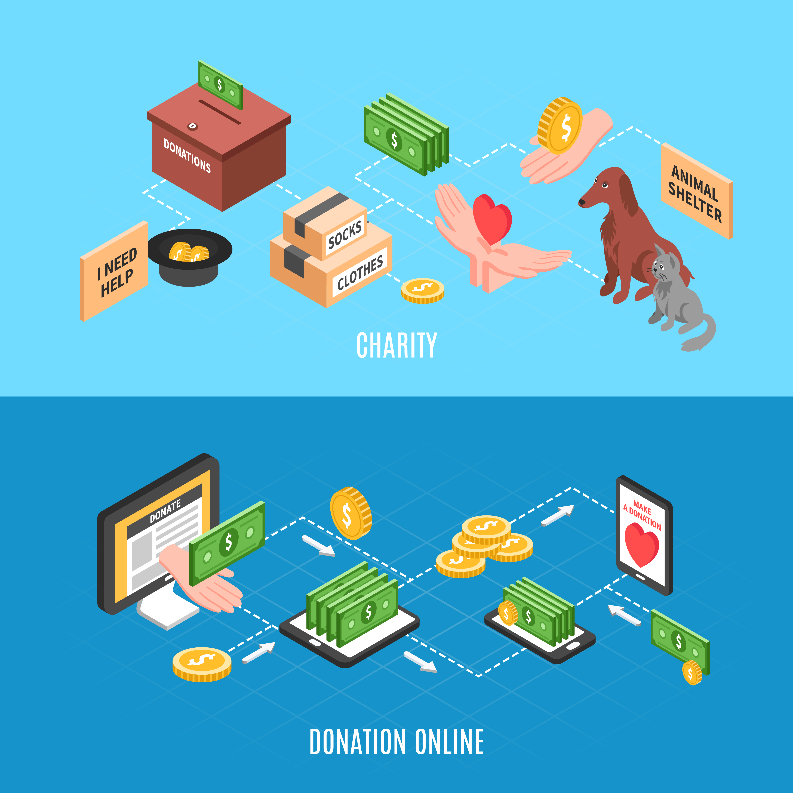
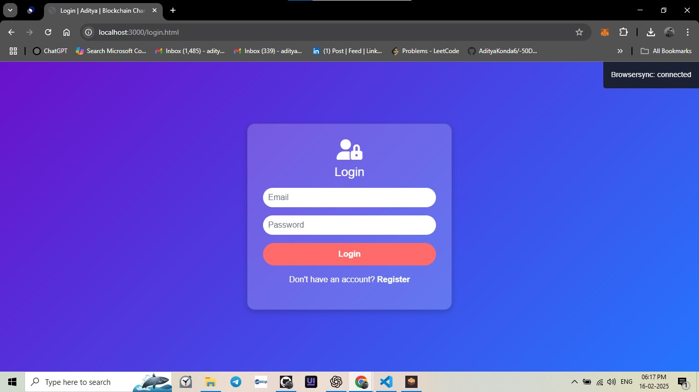
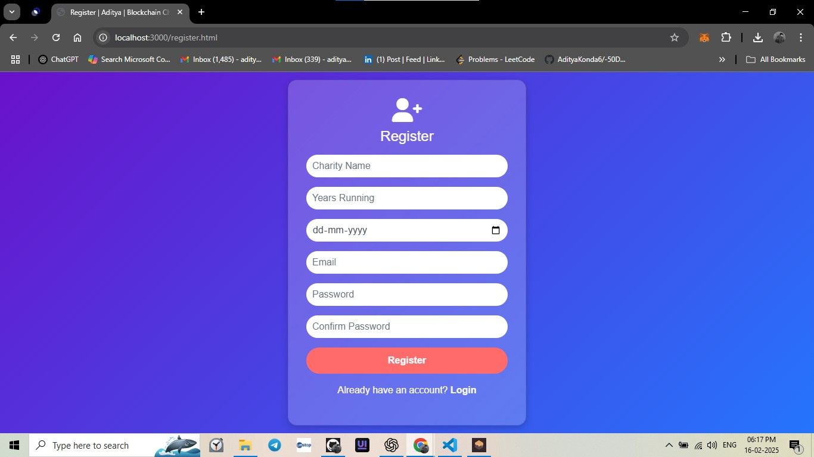
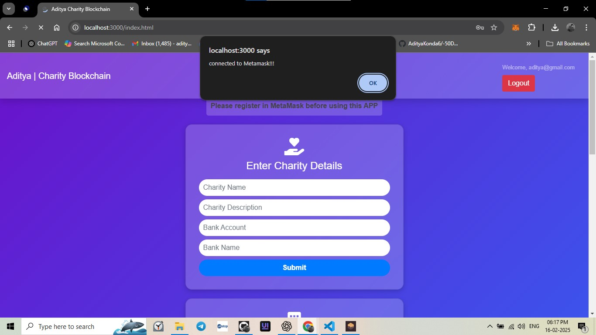
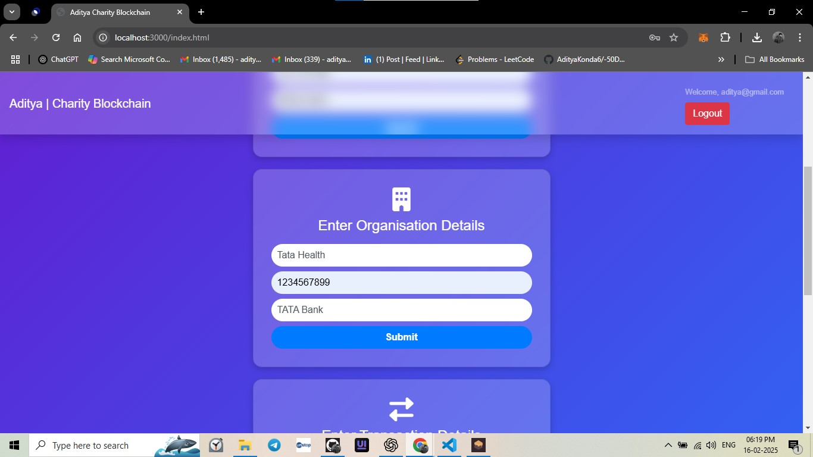
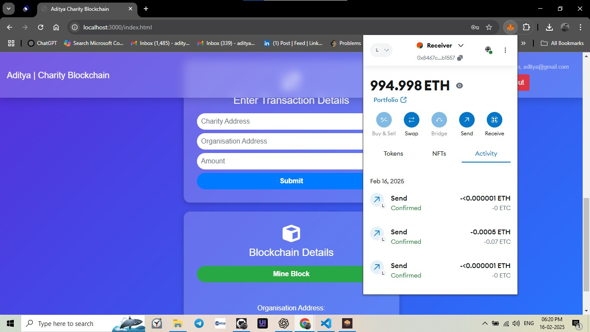

# Charity-Blockchain-Project-Aditya_Konda


## Introduction
The **Charity Blockchain Project** is a decentralized platform that ensures transparency and security in charitable donations using blockchain technology. The platform leverages smart contracts to facilitate secure transactions and prevent fraud, ensuring that funds reach the intended recipients.




## Features
- **Decentralized Donations**: Uses blockchain to securely transfer funds.
- **Smart Contracts**: Automates and ensures transparency in donations.
- **User Authentication**: Secure login with MetaMask.
- **Transaction Tracking**: Donors can track their funds on the blockchain.
- **Mining Blocks**: Transactions are verified and stored in blocks.
- **Organization Management**: NGOs can register and receive funds.

## Tech Stack
- **Frontend**: HTML, CSS, JavaScript
- **Backend**: Node.js, Express.js
- **Blockchain**: Ethereum, Solidity, Web3.js
- **Database**: MongoDB
- **Authentication**: MetaMask

## Installation Guide
Follow these steps to set up and run the project on your local machine:

### Prerequisites
- Node.js and npm installed
- MetaMask Extension in your browser
- Ganache for local blockchain testing

### Steps
1. **Clone the Repository**
   ```sh
   git clone https://github.com/AdityaKonda6/Charity-Blockchain-Project-Aditya_Konda.git
   cd Charity-Blockchain-Project-Aditya_Konda
   ```
2. **Install Dependencies**
   ```sh
   npm install
   ```
3. **Start the Blockchain (Ganache)**
   - Open Ganache and create a new workspace.
   - Configure it to use a local Ethereum network.

4. **Deploy Smart Contracts**
   ```sh
   truffle migrate --reset
   ```
5. **Run the Project**
   ```sh
   npm start
   ```
6. **Open in Browser**
   - Navigate to `http://localhost:3000`
   - Connect MetaMask and start donating!

## Project Workflow
1. **User Registration & Login**
   - Users register and log in using MetaMask.
   - They can view registered charities and their details.
   
2. **Making Donations**
   - Users send donations via the blockchain.
   - Transactions are verified through smart contracts.
   
3. **Mining and Verification**
   - Each donation is recorded as a block in the chain.
   - Miners verify transactions to ensure authenticity.

4. **Tracking Transactions**
   - Donors can track their donations via transaction IDs.
   - Transparency is maintained as all transactions are public.

## Screenshots
1. **Login Page**


2. **Register Page**
 

3. **Welcome**
 

4. **Charity Details**
 

5. **Organization**
 

6. **Organization Details**
 

7. **MetaMask Authentication**
 

8. **MetaMask**
 

9. **Copy Address For Sender**
 

10. **Copy Address Of Receiver For Transaction**
 

11. **Transfer Request**
 

12. **Transfer Confirmed**
 

13. **Mine A Block**
 

14. **Mine A Block Successful**
 

15. **Download Certificate**
 

16. **Certificate Proof**
  


## Contributing
Contributions are welcome! Feel free to fork this repository and submit pull requests.

## License
This project is licensed under the MIT License.

---
Developed by **Aditya Konda**

## Hey there 👋, I'm [<a href="https://adityakonda04.vercel.app/">Aditya!</a>]([https://github.com/AdityaKonda6])

[](https://twitter.com/AdityaKonda7)
[](https://www.linkedin.com/in/aditya-adi-konda/)
[](https://www.instagram.com/konda_aditya/)

### Glad to see you here! &nbsp; 

I want to be a Software Developer but I am currently in college studying in IT with a mission to revolutionize how the world hires with AI. 🚀

I have a passion for problem-solving and pioneering first-principle thinking, driven by purpose and fueled by the challenge of finding solutions, with a strong foundation in Java, Python, SQL etc. I've led diverse tech teams covering Middleware, Backend and building scalable products from scratch with the commitment to making a positive impact through technology.

I'm an explorer of new tech, an avid learner, and a problem-solver at heart. When I'm not in code, you'll find me watching tech-related YouTube videos, fueling my curiosity.

Feel free to connect with me @kondaaditya for all things tech or just to say hello! Let's shape the future of tech together. 🌟

Joined Github **3** years ago.

Since then I pushed **20**+ commits, opened **15**+ issues, submitted **3**+ pull requests, created **64**+ gists and contributed to **18**+ public repositories.

Like My Work?

<a href="https://www.buymeacoffee.com/adityakonda04" target="_blank"></a>

<p align="left">  </p>

<p align="left"> <a href="https://github.com/ryo-ma/github-profile-trophy"></a> </p>


### Talking about Personal Stuff:

- 🛠 &nbsp; I’m currently working with Java, SQL, React, Python etc.
- 🚀 &nbsp; I’m currently exploring ML, Gen AI, etc.
- 💬 &nbsp; Ask me anything [here](https://github.com/AdityaKonda6/MyGitHub-Intro/issues)! I am happy to help.
- 👾 &nbsp; Fun fact: Equal is Not Always Equal in JS.
- 📫 &nbsp; Reach me out: adityakonda04@gmail.com.

### My Absolute Favorites:

- 💻 &nbsp; I love exploring new technologies and building cool stuff.
- 📰 &nbsp; Reading, writing & watching Tech Stuff whenever possible.
- 🍕 &nbsp; Meetups & Tech Events & Hackathons.

### Languages and Tools:

<code></code>
<code></code>
<code></code>
<code></code>
<code></code>
<code></code>
<code></code>
<code></code>
<code></code>
<code></code>


### Projects and Dev Stuffs:

<details>
  <summary><b>⚡ Github Stats</b></summary>

  <br />
  
  
</details>

<details>
  <summary><b>☄️ Github Streaks</b></summary>

  <br />
  
</details>
<details>
  <summary><b>☄️ LeetCode Stats</b></summary>

  <br />
   <p align="center"></p>
   </details>
<details>
  <br />
  <summary><b>⚙️ Things I use to get stuff done</b></summary>
  	<ul>
  	    <li><b>OS:</b> Windows 10 Home</li>
	    <li><b>Laptop: </b> Lenovo Ideapad 320</li>
  	    <li><b>Browser: </b> Chrome </li>
	    <li><b>Terminal: </b> ZSH: Oh My Zsh (PowerLevel10k)</li>
	    <li><b>Code Editor:</b> VSCode - The best editor out there</li>
	    <li><b>To Stay Updated:</b> Twitter, Product Hunt and Hacker News</li>
	</ul>
</details>
<br>


#

<div align="center">
